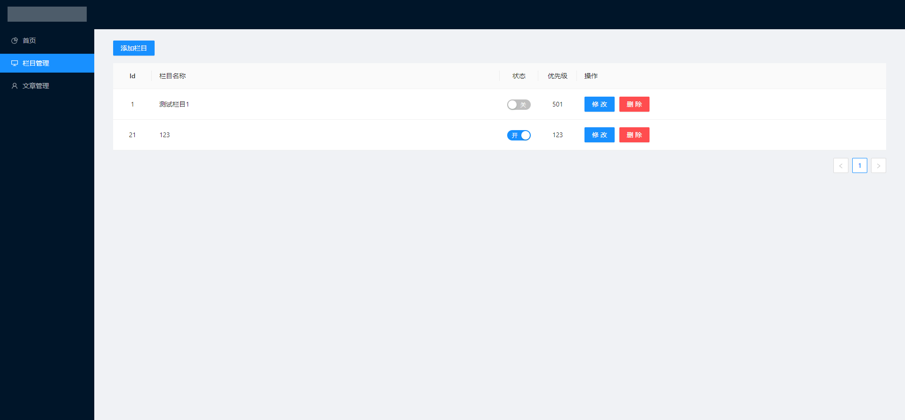
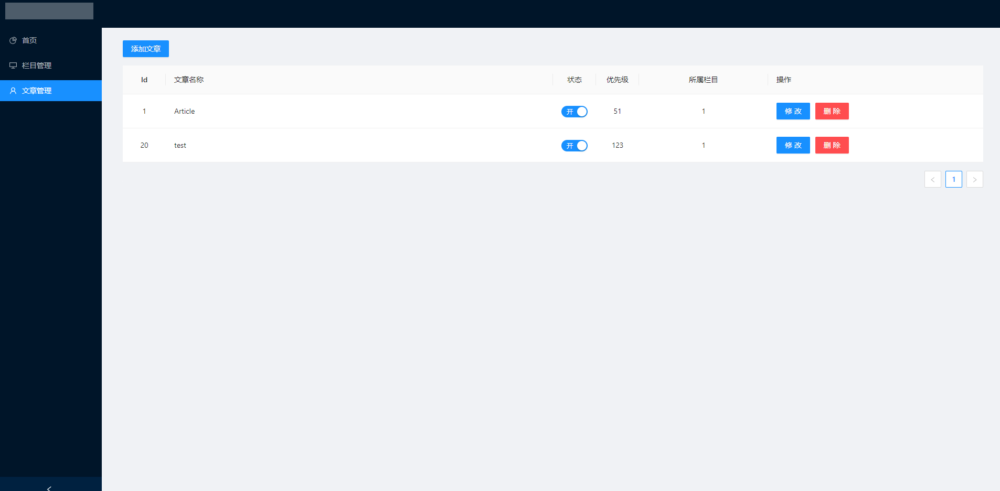

# 工程简介
    使用thymeleaf作为模板引擎使用户只需了解html基本使用就可自行diy网站.
    兼容thymeleaf语法
# 使用教程
    在<html>标签内包含 xmlns:th=""

# 标签说明
    <th:column
        name="name"      //name名称可自定义
        th:text="${name}"
    >
    </th:column>

    <th:article
        name="name"      //name名称可自定义
        id="1"           //id 为栏目id
        th:text="${name}"
    >
    </th:column>

# 后台截图

